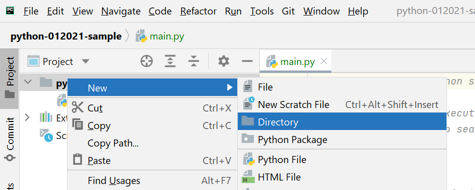
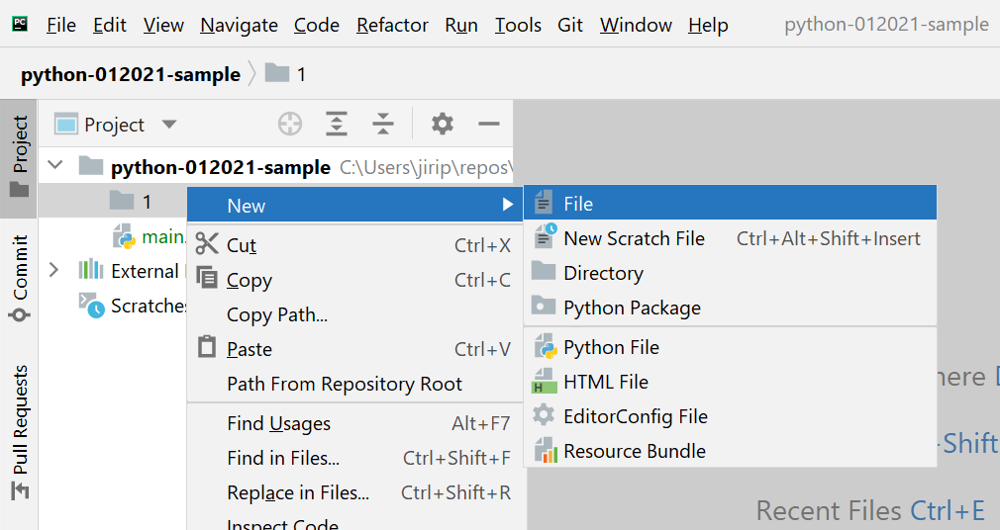
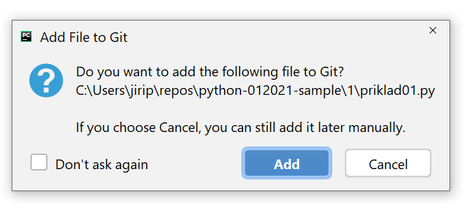
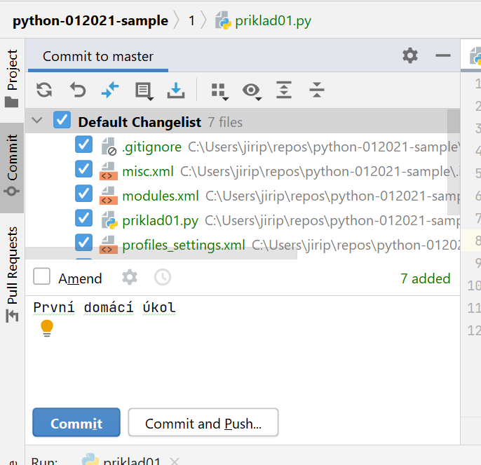
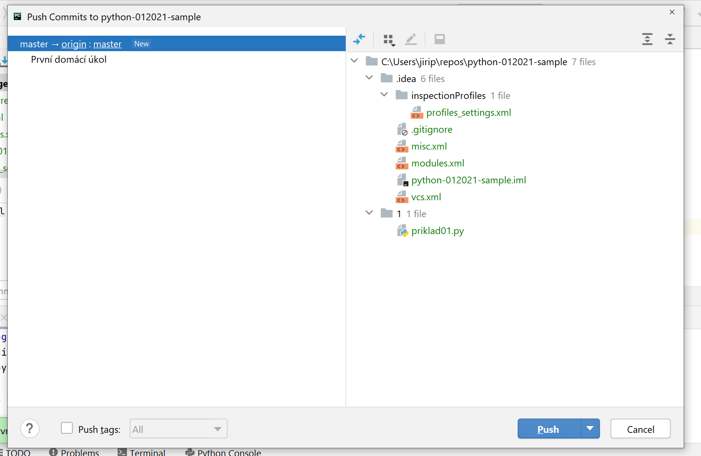
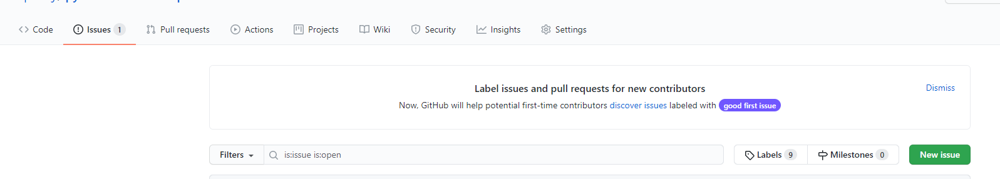
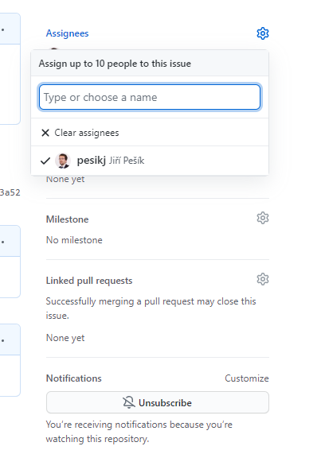
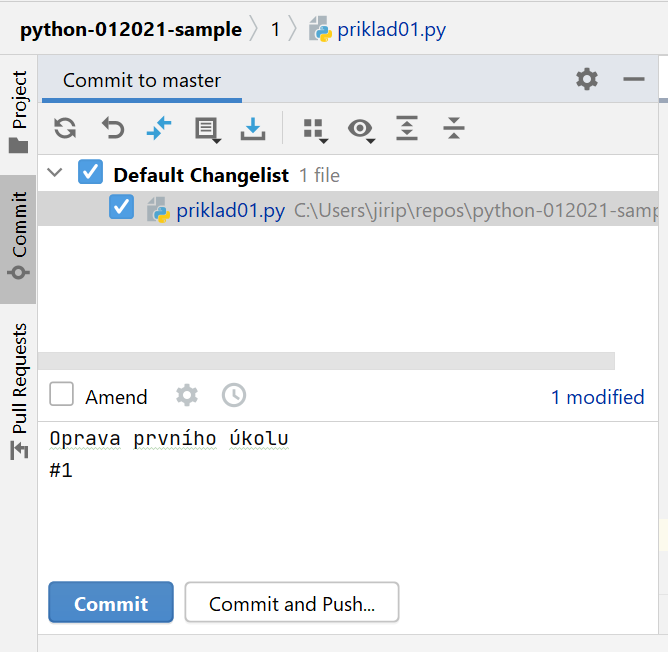
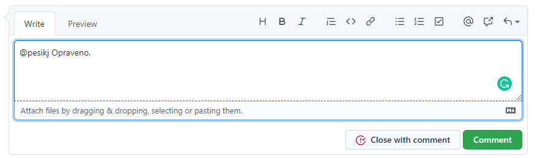
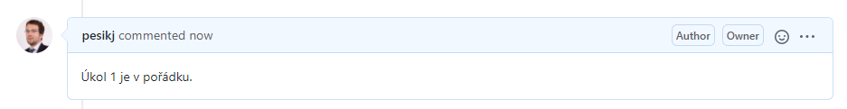

# Domácí úkoly k dlouhodobému kurzu Python

V tomto repozitáři najdeš zadání domácích úkolů k dlouhodobému kurzu Python, 
který organizují Czechitas.

Rozvrh a úkoly k jednotlivým lekcím najdeš zde:
* [zadani/Lekce 1](zadani/1/lekce.md),
* [zadani/Lekce 2](zadani/2/lekce.md),
* [zadani/Lekce 3](zadani/3/lekce.md),
* [zadani/Lekce 4](zadani/4/lekce.md),
* [zadani/Lekce 5](zadani/5/lekce.md).

Úkoly prosím zpracuj do 14 dní od lekce, ke které se vztahují. Nejedná se o striktní pravidlo, ale
určitě je dobré ho dodržovat, protože některé kapitoly kurzu na sebe navazují a pomůže ti, pokud budeš teorii
průběžně procvičovat. Navíc se ti práce tolik nenakupí :-) Určitě bys neměla odevzdávat úkol později než 4 týdny po lekci.

Každou lekci dostaneš 5 domácích úkolů a za každý můžeš získat 1 bod. K získání certifikátu musíš kromě docházky získat 60 % bodů
za domácí úkoly, tj. alespoň 36 bodů.

Některá zadání jsou trochu volná. Pokud si nejsi jistá, jak by měl program vypadat (např. na co se ptát, co vypisovat atd.),
zkus si představit, jak by měl program vypadat, aby se s ním uživateli dobře pracovalo a aby pro něj byl srozumitelný.
Současně předpokládej, že uživatel je disciplinovaný a pokud je třeba požádán o číslo, nezkouší zadávat řetězec atd.

Určitě se ale neváhej zeptat kouče nebo lektora, pokud ti nějaké zadání není jasné nebo pokud si s jeho splněním nevíš rady.
Rádi ti pomůžeme :-)

# Přidání kouče do repozitáře

Před práci na úkolech přidej svého kouče do repozitáře. To uděláš tak, že si otevřeš svůj repozitář
na GitHubu, klikneš na `Settings`, poté na `Manage access` a tam na tlačítko `Invite a collaborator`.

Otevře se okno, do kterého zadej e-mail nebo přihlašovací jmého konkrétního kouče nebo lektora.

# Jak odevzdat domácí úkol

Níže najdeš návod, jak odevzdat domácí úkol.

V rámci přípravy na kurz bys již měla mít připravený repozitář `python-012021`. Vytvoř si nový adresář s číslem lekce.

Vytvoř si soubor pro uložení příkladu (např. `priklad01.py`).

PyCharm se tě zaptá, zda chceš soubor uložit do Gitu. Klikni na `Add`.
Protože `Add` budeš používat prakticky vždy, můžeš zaškrtnout volbu `Don't ask again`.

V nově otevřeném editoru napiš program.

Během práce možná uvidíš hlášku `Project configurations files can be added to Git` vpravo dole.
Pokud klikneš na `Always Add`, uloží se soubory, které vytvořil PyCharm, do Gitu. To ničemu nevadí, takže
klidně klikni na `Always Add` a hlášky se zbavíš.

Pokud budeš chtít program spustit, klikni pravým tlačítkem na záložku s názvem souboru nad
editorem a poté v menu vyber Run (např. `Run 'priklad01'`).

Program uvidíš spuštěný v terminálu dole.

Jakmile chceš úkol uložit, klikni na panelu úplně vlevo v PyCharmu na možnost `Commit`. Zaškřtni
pole `Default Changelist`. Pokud jsi klikla na `Always Add` v předchozím kroku, uvidíš tam více souboru,
nikoli pouze tvůj program. To ale vůbec nevadí. Do textového pole pod seznamem souborů přidej nějaký popis aktuálního
*commitu* a klikni na `Commit and Push`.

V kontrolním okně, které se objeví, klini na `Push`.

# Informace o odevzdání úkolu

Aby kouč o odevzdání úkolu věděl, vytvoř Issue a napiš mu, které úkoly
máš hotové a chtěla bys je zkontrolovat. U repozitáře klikni na `Issues` a poté
vytvoř nové Issue pomocí tlačítka `New issue`.

Do Issue napiš, které úkol bys chtěla zkontrolovat. Ideální bude, když v textu zmíníš
kouče, který by měl úkol zkontrolovat, pomocí zavináče a jeho přihlašovacího jména.

Všimni si, že každé Issue mé své číslo, které je označeno znakem # za názvem Issue. Například Issue
na obrázku má číslo 1.

Další možností je, že Issue přiřadíš koučovi. To uděláš tak, že v menu vpravo klikneš na ozubené
kolečko u pole `Assignees` a vybereš daného kouče. Současně vyber i sebe, protože ty budeš možná pracovat na
úpravě úkolu :-)

# Oprava úkolu

Kouč nebo lektor ti zadá hodnocení úkolu jako  komentář k Issue. O přidání komentáře budeš informována mailem.
V textu Issue uvidíš, které úkoly ti kouč uznal a ke kterým měl připomínku. Je-li zadaná připomínka,
bude pravděpodobně nutné program upravit.

Pokud poznámce nerozumíš, napiš do pole níže komentář o tom, čemu nerozumíš a co potřebuješ vysvětlit.

V PyCharmu uprav svůj program tak, aby vyhovoval připomínce kouče. Poté opět klikni na panel Commit vlevo,
abys program nahrála na GitHub. Ideální bude, pokud do textového pole dole vložíš číslo Issue spolu se znakem #,
tj. např. #1. Tím se commit propojí s Issue.

Nyní si otevři Issue.

Pokud jsi pole výše napsala číslo Issue, uvidíš na obrazovce odkaz na poslední změnu ve tvém programu.

Zkus si na odkaz kliknout. Dostaneš se na stránku, kde jsou vidět změny ve tvém programu. Zelenou barvou jsou
podbarveny nové řádky a červenou smazané řádky.

Vrať se na stránku s aktuálním Issue. Přidej komentář o tom, že jsi program opravila. Pokud měl kouč více připomínek a ty jsi
zatím opravila pouze něco, popiš trochu podrobněji, co jsi opravila.

Kouč přidá komentář k Issue, kde ti dá vědět, zda je úkol takto v pořádku.

