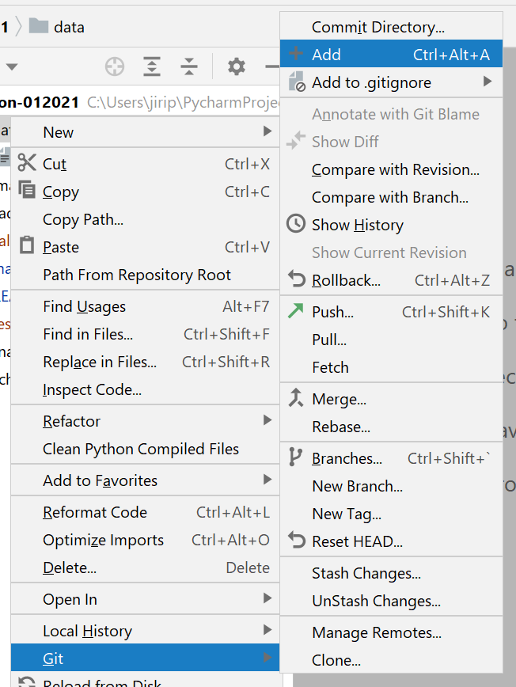
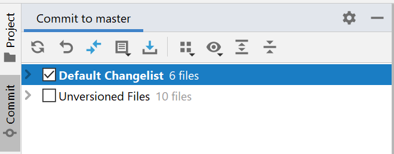

# Seznam příkladů

|Příklad |
|---|
| [Příklad 36](priklad36.md) |
| [Příklad 37](priklad37.md) |
| [Příklad 38](priklad38.md) |
| [Příklad 39](priklad39.md) |
| [Příklad 40](priklad40.md) |

Úkoly se týkají Djanga, takže prosím neodevzdávejte úkoly do samostatných programů, jako tomu bylo dříve, ale vytvořte si postupně podle instrukcí projekt, v projektu aplikaci a následně pohledy a upravte adresy. Všechny úkoly budou součástí jednoho projektu, takže nahrajte na Git celý projekt a tím všechny úkoly odevzdáte.

## Jak snadno nahrát soubory do Gitu

V Pycharmu lze jednoduše nahrát celý projekt do Gitu. Klikni pravým tlačítkem na adresář s projektem a v menu vyber možnost `Git -> Add`.

Následně jsou všechny soubory přidány do `Default Changelist`. Vlevo překlikni na záložku `Commit`, zaškrtni `Default Changelist` a následně můžeš pokračovat stejně jako při běžném odevzdání.

